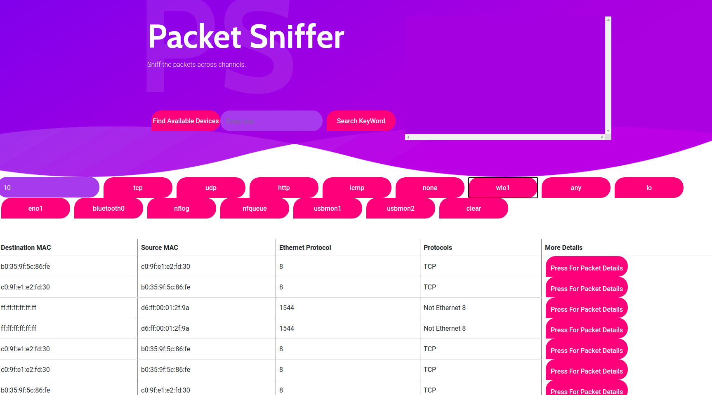
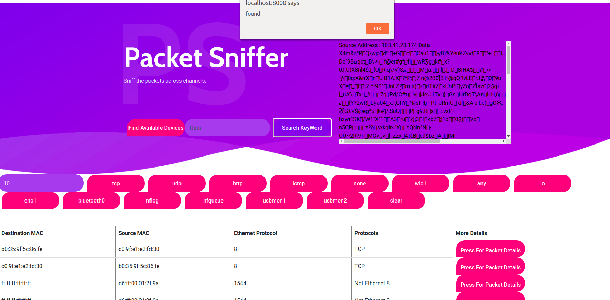

# PacketSniffer
Packet Sniffer: 
It Sniffs the packets travelling in the network and Web GUI is made using eel library and a Python backend.





## Getting Started
- Clone the repo and cd into the directory
```sh
$ git clone https://github.com/rajatkhanna1999/PacketSniffer.git
$ cd PacketSniffer
```

- Install eel, and pyinstaller

```sh
$ pip install eel pyinstaller pypng
```

- Run the app

```sh
$ sudo python PacketSniffer.py
```

## Packaging the app
You can pass any valid `pyinstaller` flag in the following command to further customize the way your app is built.
```sh
$ python -m eel PacketSniffer.py web --noconsole --onefile --icon=barcode.icns
```
