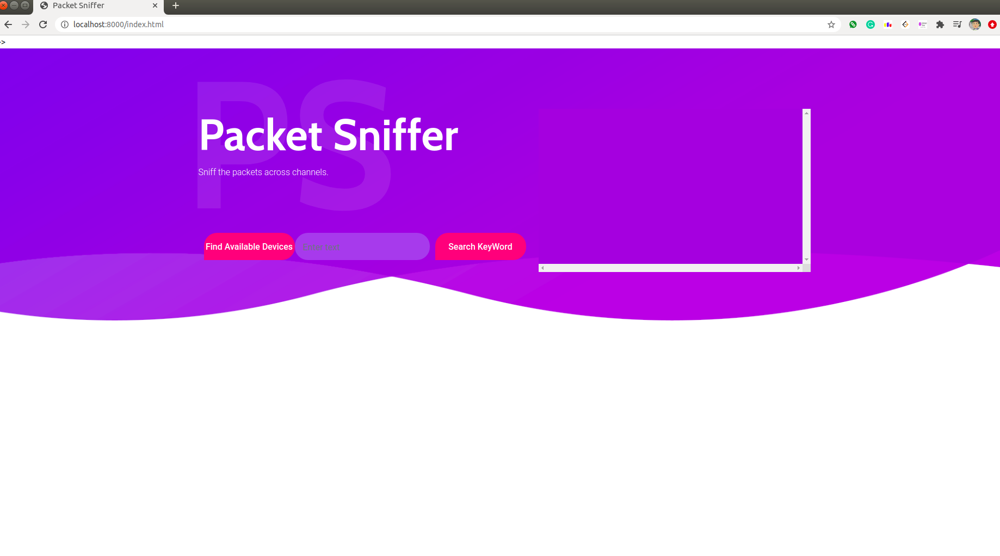

# PacketSniffer
Packet Sniffer: 
It Sniffs the packets travelling in the network. Web GUI uses eel library to interact between Python backend and frontend from HTML, CSS and Javascript.




## Getting Started
- Clone the repo and cd into the directory
```sh
$ git clone https://github.com/rajatkhanna1999/PacketSniffer.git
$ cd PacketSniffer
```

- Install eel, and pyinstaller

```sh
$ pip install eel pyinstaller pypng
```

- Run the app

```sh
$ sudo python3 PacketSniffer.py
```

- Open the local host in browser
```sh
$ http://localhost:8000/index.html
```

## Packaging the app
You can pass any valid `pyinstaller` flag in the following command to further customize the way your app is built.
```sh
$ python -m eel PacketSniffer.py web --noconsole --onefile --icon=packet-sniffer-tools.icns
```
